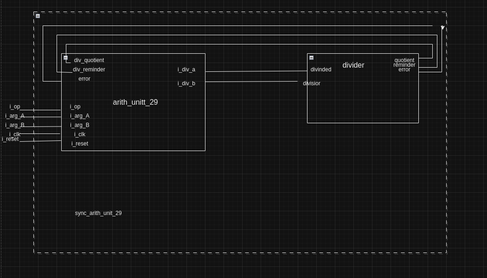
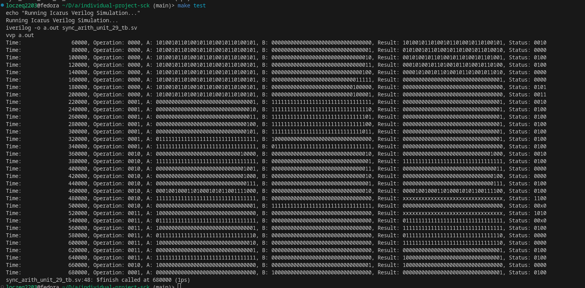
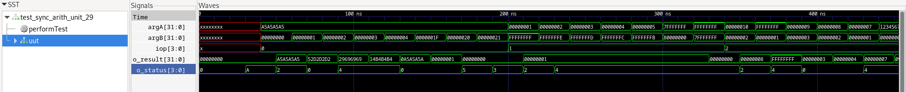
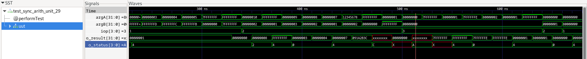
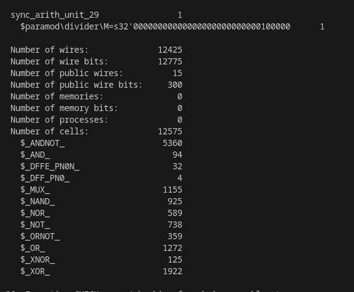

# Projekt Modułu `sync_arith_unit_29`

## Opis Projektu

Projekt `sync_arith_unit_29` obejmuje realizację synchronicznej jednostki arytmetyczno-logicznej (ALU) operującej na liczbach całkowitych zapisanych w kodzie znak-moduł (ZM). Projekt składa się z modelu układu cyfrowego opisanego w języku SystemVerilog, wraz z testbenchami do weryfikacji poprawności działania modelu. Układ został także przetestowany po procesie syntezy przy użyciu narzędzia open-source Yosys.

## Uproszczony diagram

## Skład Projektu

### Główne moduły

#### `sync_arith_unit_29`
Centralny moduł ALU odpowiedzialny za wykonanie operacji określonych przez kod operacji na wejściach. Wejścia obejmują argumenty `iarg_A` i `iarg_B`, sygnał zegarowy `clk` oraz sygnał resetujący `i_reset`. Wyniki operacji są dostępne na wyjściach `o_result` i `o_status`.

#### `divider`
Moduł realizujący dzielenie z resztą. Posiada wejścia dla dzielnej (`i_div_a`) i dzielnika (`i_div_b`) oraz wyjścia dla ilorazu (`div_quotient`), reszty (`div_remainder`) oraz flagi błędu (`error`).

### Testbench

- `sync_arith_unit_29_tb`: Skrypt testowy (`testbench`) używany do symulacji działania modułu `sync_arith_unit_29`, który generuje przebiegi testowe zapisywane w pliku `.vcd`.

### Dodatkowe pliki

- `waveform.vcd`: Plik z przebiegami generowany przez `testbench`, umożliwiający wizualizację i analizę sygnałów za pomocą narzędzi takich jak GTKWave.

### Narzędzia pomocnicze

- Skrypty automatyzujące proces kompilacji i symulacji (np. `Makefile`).
- Materiały dokumentacyjne, w tym diagramy, zrzuty ekranu.

## Operacje Realizowane przez Układ

Moduł `sync_arith_unit_29` został zaprojektowany do realizacji następujących operacji na dwóch m-bitowych wektorach wejściowych A i B:

1. **Przesunięcie Bitowe** (`OP_BITWISE_SHIFT`): Przesuwa wektor A o B bitów w prawo.
2. **Porównanie** (`OP_COMPARE_AS`): Sprawdza, czy liczba A jest mniejsza bądź równa zaprzeczonej liczbie B.
3. **Dzielenie** (`OP_DIVIDE`): Dzieli liczbę A przez zaprzeczoną liczbę B.
4. **Konwersja ZM na U2** (`OP_ZM_TO_U2`): Konwertuje liczbę A z kodu ZM na kod U2.

## Porty Układu

Układ posiada określone porty wejściowe i wyjściowe:

- `iop`: n-bitowe wejście określające kod operacji.
- `iarg_A`: m-bitowe wejście argumentu A.
- `iarg_B`: m-bitowe wejście argumentu B.
- `clk`: wejście zegarowe układu.
- `i_reset`: wejście resetu synchronicznego wyzwalanego stanem niskim.
- `o_result`: wyjście synchroniczne z układu.
- `o_status`: 4-bitowe wyjście synchroniczne informujące o statusie operacji.

## Statusy Operacji

Status operacji jest sygnalizowany przez bity w `o_status`:

- `ERROR`: Sygnalizacja niepoprawnego wyniku operacji.
- `NOT EVEN_1`: Sygnalizuje nieparzystą liczbę jedynek w wyniku.
- `ZEROS`: Sygnalizuje, że wszystkie bity wyniku są na 0.
- `OVERFLOW`: Sygnalizuje przepelnienie wyniku operacji.

## Symulacja 

Do symulacji projektu użyto Icarus Verilog (iverilog). Procedura testowania obejmowała różnorodne scenariusze, w tym przypadki graniczne i błędne, co pozwoliło na kompleksową weryfikację działania układu. Poniższy zrzut ekranu jest wyjściem wygenerowanym do konsoli przez `sync_arith_unit_29_tb.sv`. Prezentowane wyniki są zgodne z oczekiwaniami.

Dla porównania prezentuję sygnał (`waveform.vcd`) zobrazowany w programie `GTKwave`.

**Operacja 0000 (Bitwise Shift)**

| Czas (ns) | Operacja | A (bin -> dec)           | B (bin -> dec) | Wynik (bin -> dec)         | Status |
|-----------|----------|--------------------------|----------------|-----------------------------|--------|
| 60000     | 0000     | 10100101101001011010010110100101 (2789541637) | 00000000000000000000000000000000 (0)  | 10100101101001011010010110100101 (2789541637) | 0010   |
| 80000     | 0000     | 10100101101001011010010110100101 (2789541637) | 00000000000000000000000000000001 (1)  | 01010010110100101101001011010010 (1394770818) | 0000   |
| 100000    | 0000     | 10100101101001011010010110100101 (2789541637) | 00000000000000000000000000000010 (2)  | 00101001011010010110100101101001 (697385409)  | 0100   |
| 120000    | 0000     | 10100101101001011010010110100101 (2789541637) | 00000000000000000000000000000011 (3)  | 00010100101101001011010010110100 (348692704)  | 0100   |

**Operacja 0001 (Compare AS)**

| Czas (ns) | Operacja | A (bin -> dec)    | B (bin -> dec)         | Wynik (bin -> dec)   | Status |
|-----------|----------|-------------------|------------------------|----------------------|--------|
| 220000    | 0001     | 00000000000000000000000000000001 (1)   | 11111111111111111111111111111111 (-1) | 00000000000000000000000000000001 (1)    | 0010   |
| 240000    | 0001     | 00000000000000000000000000000010 (2)   | 11111111111111111111111111111110 (-2) | 00000000000000000000000000000001 (1)    | 0100   |
| 260000    | 0001     | 00000000000000000000000000000011 (3)   | 11111111111111111111111111111101 (-3) | 00000000000000000000000000000001 (1)    | 0100   |
| 280000    | 0001     | 00000000000000000000000000000100 (4)   | 11111111111111111111111111111100 (-4) | 00000000000000000000000000000001 (1)    | 0100   |

**Operacja 0010 (Divide)**
| Czas (ns) | Operacja | A (bin -> dec)    | B (bin -> dec) | Wynik (bin -> dec)         | Status |
|-----------|----------|-------------------|----------------|-----------------------------|--------|
| 360000    | 0010     | 00000000000000000000000000010000 (16) | 00000000000000000000000000000010 (2) | 00000000000000000000000000001000 (8) | 0010   |
| 380000    | 0010     | 11111111111111111111111111111111 (-1) | 00000000000000000000000000000001 (1) | 11111111111111111111111111111111 (-1) | 0100   |
| 400000    | 0010     | 00000000000000000000000000001001 (9)  | 00000000000000000000000000000011 (3) | 00000000000000000000000000000011 (3)  | 0000   |
| 420000    | 0010     | 00000000000000000000000000001000 (8)  | 00000000000000000000000000000010 (2) | 00000000000000000000000000000100 (4)  | 0000   |

**Operacja 0011 (ZM to U2)**
| Czas (ns) | Operacja | A (bin -> dec)            | B (bin -> dec) | Wynik (bin -> dec)           | Status |
|-----------|----------|---------------------------|----------------|-------------------------------|--------|
| 520000    | 0011     | 10000000000000000000000000000000 (-2147483648) | 00000000000000000000000000000000 (0) | xxxxxxxxxxxxxxxxxxxxxxxxxxxxxxxx | 1010   |
| 540000    | 0011     | 01111111111111111111111111111111 (2147483647)  | 00000000000000000000000000000000 (0) | 01111111111111111111111111111111 (2147483647) | 00x0   |
| 560000    | 0011     | 10000000000000000000000000000001 (-2147483647) | 00000000000000000000000000000000 (0) | 11111111111111111111111111111111 (-1) | 0100   |
| 580000    | 0011     | 01111111111111111111111111111110 (2147483646)  | 00000000000000000000000000000000 (0) | 01111111111111111111111111111110 (2147483646) | 0000   |

### Wnioski z analizy wyników

- **Obsługa Operacji Bitowych:**  ALU poprawnie przetwarza operacje bitowe, takie jak przesunięcia bitowe. Można to zauważyć w wynikach, gdzie wartości iarg_A są przesuwane o liczbę pozycji określoną przez iarg_B.

- **Reakcja na Sygnały Resetu:** Wartości dla o_status i o_result są aktualizowane tylko wtedy, gdy sygnał resetu nie jest aktywny, co wskazuje na to, że układ poprawnie reaguje na sygnał resetowania.

- **Obsługa Błędów:** Status o_status pokazuje, że układ jest w stanie rozpoznać błędne stany, takie jak próba przesunięcia bitowego poza zakres (overflow) lub dzielenie przez zero.

- **Zachowanie przy Braku Zmiany:** Gdy operacja nie jest wymagana lub gdy wejścia pozostają niezmienione, wynik pozostaje taki sam, co wskazuje na stabilność układu.

- **Poprawność Wyników:** Wyniki wskazują na poprawność operacji dla prostych działań logicznych i arytmetycznych. Na przykład, wartość iarg_A pozostaje niezmieniona, gdy iarg_B jest ustawione na zero, co sugeruje poprawną operację przesunięcia bitowego.

- **Detekcja Stanów Nieokreślonych:** System poprawnie identyfikuje stany nieokreślone (x) i sygnalizuje to w o_status, co jest ważne dla uniknięcia nieprawidłowego działania w rzeczywistych aplikacjach.

- **Weryfikacja Przypadków Granicznych:** Symulacja obejmuje również testy na przypadki graniczne, takie jak największe możliwe wartości dla danego rozmiaru słowa (np. wszystkie bity ustawione na 1), co jest krytyczne dla kompletnego przetestowania ALU.

Każda operacja wykonywana jest w kolejnych odstępach czasowych co 20000 ns (nanosekund), co wskazuje na synchroniczny charakter jednostki i jej działanie w regularnych odstępach zegarowych.

Wartości o_status wydają się być prawidłowo ustawiane w większości przypadków.

## Synteza
Synteza odbywa się przy użyciu Yosys. Z domyślną konfiguracją i Yosys. Statystyki wykorzystania zasobów przedstawiają się następująco:

## Autor
Łukasz Siemionek